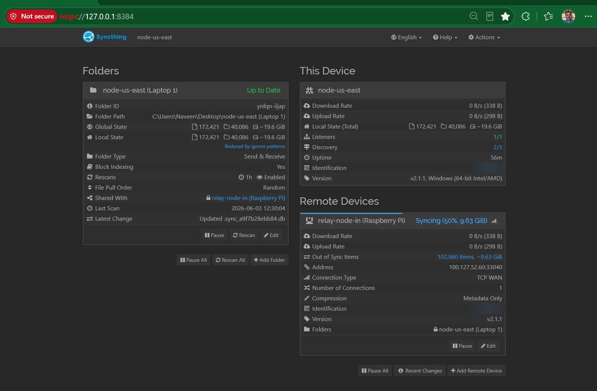
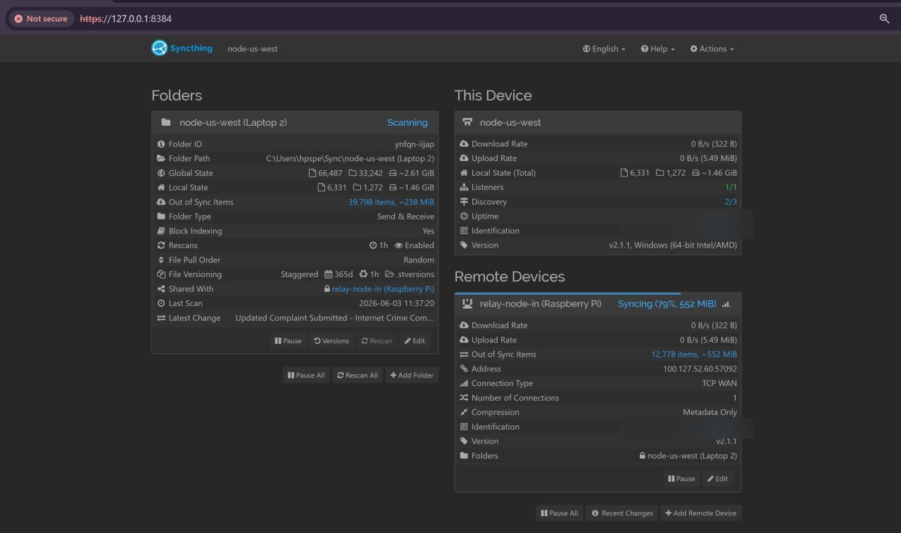

# Distributed File Sync Mesh

**A self-hosted, always-on, geo-distributed personal cloud — keeping files in sync across two continents, 24/7, without trusting a single cloud vendor.**

> Built to solve a real problem: I travel internationally between the US and India with my laptops, and need all ~19.6 GiB of my files always accessible, always current — on any machine, in any country. The Raspberry Pi in India is the permanent anchor. The laptops roam the world. Everything stays in sync automatically.

[](LICENSE)
[](https://github.com/CloudArchitectPro)
[](docs/architecture.md)
[](SECURITY.md)
[](docs/setup-windows.md)
[](docs/architecture.md)

---

## The Real-World Problem This Solves

I'm a cloud engineer who travels between the United States and India. I carry my laptops with me. My files — projects, configs, certifications, work documents — need to be on every machine, fully current, no matter where I am in the world.

The constraints were clear:
- **No cloud vendor lock-in** — no paying monthly for Google Drive or Dropbox
- **No plaintext exposure** — a stolen device or SD card should expose nothing readable
- **No open ports** — the Pi in India is behind CGNAT; traditional port forwarding is impossible
- **No single point of failure** — if the relay goes down, the laptops still sync directly to each other

This is the infrastructure I built to solve that.

---

## Architecture

```
   North America 🌎                          North America 🌎
   (roams globally)                          (roams globally)
┌──────────────────────┐               ┌──────────────────────┐
│    node-us-east      │               │    node-us-west      │
│    Laptop 1          │               │    Laptop 2          │
│                      │               │                      │
│  OS:  Windows 10/11  │               │  OS:  Windows 10/11  │
│  App: Syncthing 2.1.1│               │  App: Syncthing 2.1.1│
│  VPN: Tailscale      │               │  VPN: Tailscale      │
│  Data: ~19.6 GiB     │               │  Data: ~19.6 GiB     │
│  Storage: plaintext  │               │  Storage: plaintext  │
└──────────┬───────────┘               └───────────┬──────────┘
           │                                       │
           │  Tailscale WireGuard                  │  Tailscale WireGuard
           │  TCP WAN · encrypted                  │  TCP WAN · encrypted
           │  (no open ports)                      │  (no open ports)
           └──────────────────┬────────────────────┘
                              │
                              │  Tailscale WireGuard
                              │  TCP WAN via DERP (CGNAT)
                              │
                   ┌──────────▼──────────┐
                   │    relay-node-in    │
                   │    Raspberry Pi 5   │
                   │                     │
                   │  OS:  Debian 13     │
                   │  App: Syncthing 2.1.1│
                   │  VPN: Tailscale     │
                   │  Location: India 🇮🇳 │  ← Asia · permanent anchor
                   │  Online: 24/7       │
                   │  Storage: CIPHERTEXT│  ← receiveencrypted only
                   │  NAT: CGNAT         │
                   └─────────────────────┘
```

> `node-us-east` and `node-us-west` reflect home base locations — both laptops are fully roaming nodes and may operate from India, Europe, or anywhere in the world. The Tailscale mesh is location-agnostic; zero reconfiguration needed when a laptop crosses continents.

### Node roles

| Node | Device | Location | Role | Data |
|---|---|---|---|---|
| `node-us-east` | Laptop 1 · Windows | North America 🌎 (roams globally) | Full sync node | Plaintext — full readable copy |
| `node-us-west` | Laptop 2 · Windows | North America 🌎 (roams globally) | Full sync node | Plaintext — full readable copy |
| `relay-node-in` | Raspberry Pi 5 | India 🇮🇳 · Asia (permanent, 24/7) | Encrypted relay anchor | Ciphertext only — unreadable without folder password |

### How data flows

1. A file changes on `node-us-east` or `node-us-west`
2. Syncthing detects the change and computes a block-level delta — only changed blocks are sent
3. Traffic routes through Tailscale's WireGuard tunnel — TCP WAN, no open ports, no firewall rules
4. `relay-node-in` in India receives and stores **encrypted blobs only** — the Pi cannot read any data
5. The second laptop pulls the update from the relay when it next comes online
6. All three nodes converge — any one can go offline without data loss or manual intervention

**When a laptop travels to India:** It connects to the same Tailscale mesh and syncs with `relay-node-in` over a local or nearby connection. No reconfiguration needed — the mesh is fully location-agnostic.

---

## Live Infrastructure

> These screenshots show the actual running system — not a demo environment.

### node-us-east (Laptop 1) — Up to Date



*`node-us-east` fully synced · 172,421 files · ~19.6 GiB · `relay-node-in` connected via TCP WAN (Tailscale IP `100.127.52.60`)*

### node-us-west (Laptop 2) — Active Sync in Progress



*`node-us-west` syncing with `relay-node-in` (India) · 79% complete · TCP WAN · Connection Type confirms traffic routes through Tailscale mesh*

---

## Why Tailscale instead of port forwarding

The Pi in India is behind CGNAT (`MappingVariesByDestIP: true`), which makes traditional port forwarding impossible — the ISP's NAT device is not under my control. Tailscale solves this with WireGuard-based NAT traversal: every device gets a stable `100.x.x.x` address reachable from anywhere in the world, with no firewall rules and no VPS required.

```bash
# Confirm CGNAT on relay-node-in
tailscale netcheck
# MappingVariesByDestIP: true  →  CGNAT confirmed, DERP relay will be used
```

DERP fallback does not affect encryption or data integrity — the DERP server sees only the WireGuard-encrypted payload and cannot read it.

---

## Why Syncthing over Nextcloud on Pi

| Factor | Syncthing | Nextcloud on Pi |
|---|---|---|
| **Installation footprint** | Single ~27 MB binary | Web server + PHP + MariaDB |
| **RAM requirement** | ~80–120 MB at idle | 512 MB minimum, often swaps on Pi |
| **SSL certificate management** | Not required (Tailscale handles it) | Required; renewal must be managed |
| **Port forwarding** | Not required | Required, or needs VPS reverse proxy |
| **Offline sync** | Laptops sync directly when relay unreachable | Client-server only; Pi must be reachable |
| **Physical security (device stolen)** | Relay stores encrypted blobs — data unreadable | Plaintext storage — full data exposure |
| **Conflict resolution** | Automatic conflict copies with timestamps | Manual intervention required |
| **CGNAT compatibility** | Native via Tailscale DERP | Requires external VPS or tunnel |
| **Sync model** | Multi-master — any node is source of truth | Client-server only |
| **Resume on disconnect** | Automatic, byte-range aware | Restarts upload from scratch |
| **Maintenance** | Headless, zero ongoing maintenance | Plugins, PHP, DB, cert updates required |

---

## Security Design

| Principle | Implementation |
|---|---|
| Zero-trust networking | Tailscale — every connection mutually authenticated via WireGuard; no IP-based trust |
| Encryption in transit | WireGuard (Tailscale) + TLS (Syncthing) — double-encrypted on every hop |
| Encryption at rest (relay) | `receiveencrypted` folder type — `relay-node-in` stores AES-SIV ciphertext, never plaintext |
| No public attack surface | Zero open ports on relay; Syncthing GUI bound to `127.0.0.1` only |
| Least privilege | Syncthing runs as unprivileged user, not root |
| Physical theft resistance | Stolen Pi SD card contains only encrypted blobs — unreadable without folder password, which never touches the relay |

See [SECURITY.md](SECURITY.md) for full threat model and incident response procedures.

---

## Quick Start

```bash
# 1. On relay-node-in (Raspberry Pi in India)
bash install-syncthing-pi.sh

# 2. On node-us-east and node-us-west (Windows laptops)
# Follow: docs/setup-windows.md

# 3. Pair devices via Syncthing GUI (http://127.0.0.1:8384)
#    Pin device addresses to Tailscale IPs only — see docs/setup-windows.md
```

---

## Performance

| Metric | Value |
|---|---|
| Files synced | 172,421 files · 40,086 folders · ~19.6 GiB |
| Sync latency end-to-end | < 30 seconds |
| Relay memory at idle | ~80–120 MB |
| Relay CPU at idle | < 2% |
| Cross-continent link | North America ↔ India (Asia) via Tailscale WireGuard · TCP WAN |

---

## Repository Structure

```
distributed-sync-mesh/
├── README.md                          # This file
├── LICENSE                            # MIT — Naveen Madhavan 2026
├── SECURITY.md                        # Threat model, incident response, key rotation
├── .stignore                          # Sync ignore patterns (node_modules, build artifacts)
├── install-syncthing-pi.sh            # Idempotent relay-node-in setup script
├── docs/
│   ├── architecture.md                # Node topology, Tailscale mesh, CGNAT deep dive
│   ├── troubleshooting.md             # 6 documented issues with root causes and fixes
│   ├── setup-windows.md               # Windows autostart, WiFi power mgmt, IP pinning
│   └── screenshots/
│       ├── syncthing-node-us-east.png # node-us-east live dashboard
│       └── syncthing-node-us-west.png # node-us-west live dashboard
└── config/
    └── pi-config-template.xml         # relay-node-in config.xml with production defaults
```

---

## Architecture Decision Records

**ADR-001 — Tailscale over manual WireGuard or port forwarding**
CGNAT at `relay-node-in` in India makes port forwarding impossible without controlling the ISP's NAT device. Tailscale provides stable routable `100.x.x.x` addresses via WireGuard NAT traversal — zero firewall changes, zero VPS cost, works from any country.

**ADR-002 — Syncthing v2.x from candidate channel**
The stable apt channel is pinned at v1.30, incompatible with the v2.x `receiveencrypted` folder protocol. The candidate channel is required for v2.1.1+.

**ADR-003 — `receiveencrypted` over `receiveonly` on relay**
`receiveonly` stores plaintext — a stolen SD card exposes all data. `receiveencrypted` stores AES-SIV ciphertext. `relay-node-in` cannot read any file without the folder password, which never leaves the laptop nodes.

**ADR-004 — Tailscale IP pinning for Syncthing device addresses**
Without explicit address pinning, Syncthing may attempt connections outside the Tailscale tunnel, causing resets under symmetric NAT. Pinning to `quic://100.x.x.x:22000` and `tcp://100.x.x.x:22000` forces all traffic through the encrypted mesh.

**ADR-005 — relay-node-in as encrypted relay, not full-copy backup**
Encrypting the relay eliminates physical security risk entirely. Full readable copies exist only on `node-us-east` and `node-us-west` — the trusted laptop nodes under my direct control.

**ADR-006 — `connectionLimitMax` and `connectionLimitEnough` set to 0**
Syncthing defaults both to 1, allowing only one device to connect to the relay simultaneously. Setting both to 0 (unlimited) is required so `node-us-east` and `node-us-west` can both connect to `relay-node-in` at the same time.

---

## AWS Equivalent Architecture

This project uses open-source tools on commodity hardware. The same architecture maps directly to managed AWS services — the engineering decisions are identical.

| This Project | AWS Equivalent | Why it maps |
|---|---|---|
| Syncthing | AWS DataSync | Async, incremental, block-level file replication |
| `relay-node-in` (India) | Amazon EC2 t4g.nano · ap-south-1 | Low-power always-on relay in the same region |
| Local folder storage | Amazon S3 | Durable object store with versioning |
| Tailscale WireGuard mesh | AWS Site-to-Site VPN / Client VPN | Encrypted private network across locations |
| `receiveencrypted` at rest | S3 SSE-C (customer-managed encryption) | Relay stores ciphertext; key stays with the client |
| Staggered file versioning | S3 Versioning + Lifecycle Policies | Automatic version retention and expiry |
| 3-node redundancy | S3 Cross-Region Replication | Multi-region durability |
| CGNAT solution (Tailscale DERP) | AWS Transit Gateway | Managed relay for unreachable private networks |
| Syncthing REST API health checks | Amazon CloudWatch + Lambda | Automated monitoring and alerting |
| Tailscale ACLs | AWS Security Groups + NACLs | Network-layer access control |

> The architecture decisions here — relay node design, async delta replication, zero open ports, least-privilege service accounts, encryption at rest with customer-managed keys — are the same decisions you'd make designing a private cloud workload on AWS. The implementation layer differs; the engineering thinking is identical.

---

## Certifications

- AWS Certified Security – Specialty (SCS-C02)
- AWS Certified Solutions Architect – Associate (SAA-C03)
- AWS Certified Cloud Practitioner

---

## License

MIT License — Copyright (c) 2026 Naveen Madhavan

Use it, fork it, build on it. See [LICENSE](LICENSE) for full terms.
